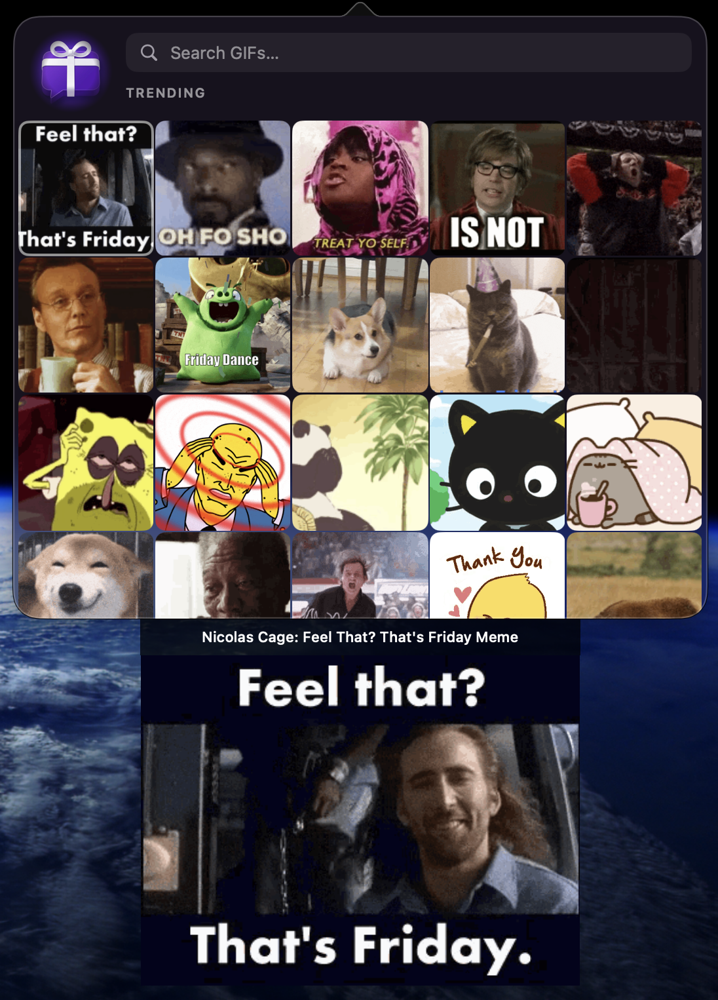
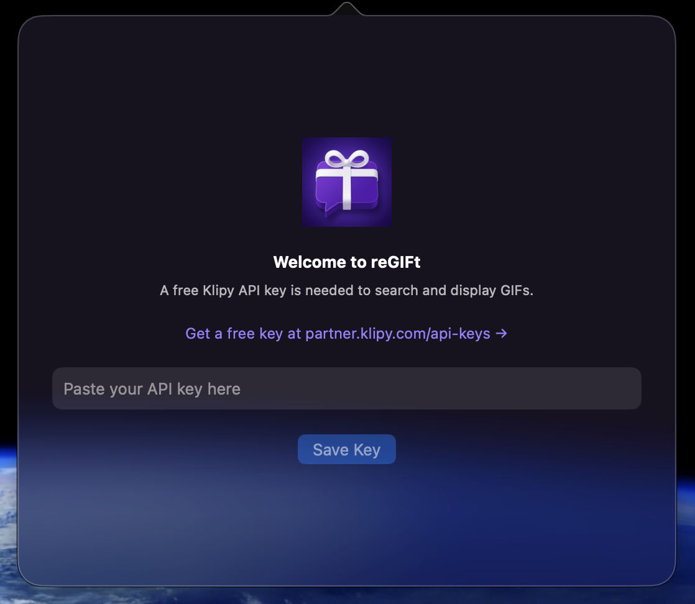

<h1> reGIFt</h1>



A macOS menu bar GIF picker powered by the [Klipy API](https://klipy.com). Browse trending GIFs, search by keyword, and drag any GIF directly into Slack, Discord, or any app that accepts file drops — where it renders as an inline animated image.

## Features

- **Menu bar native** — no Dock icon, stays out of your way
- **Trending & search** — opens to trending GIFs on first launch, updates results as you type
- **Hover preview** — hover any thumbnail to see the full image with a title caption in a panel that slides out below the grid
- **Drag and drop** — drag a GIF into Slack, Discord, or any app that accepts file drops and it renders as an animated image (not a link)
- **Branded UI** — frosted glass window with custom icon and color theme
- **Auto-start** — registers itself as a Login Item on first launch from `/Applications/`
- **Right-click menu** — toggle Launch at Login or quit from the menu bar icon

<br clear="right">

## Installation

1. Download **reGIFt.zip** from the [Releases](../../releases) page
2. Unzip and drag **reGIFt.app** to your `/Applications/` folder

**First launch — one-time Gatekeeper step:**
Because reGIFt is not distributed through the Mac App Store, macOS will show an "unidentified developer" warning the first time. To get past it:

1. In Finder, go to `/Applications/`
2. **Right-click** `reGIFt.app` → **Open**
3. Click **Open** in the dialog

macOS remembers this permanently — every subsequent launch (including auto-start at login) opens without any warning.

**API key setup:**
reGIFt requires a free Klipy API key. On first launch you'll be prompted to enter one:



1. Get a free key at **[klipy.com/api-overview](https://klipy.com/api-overview)**
2. Click the reGIFt icon in your menu bar
3. Paste your key into the setup screen and click **Save Key**

Your key is stored securely in macOS Keychain and never leaves your machine. To update your key at any time, right-click the menu bar icon and choose **Update API Key.**

<br clear="right">

## Usage


| Action                 | Result                                                         |
| ---------------------- | -------------------------------------------------------------- |
| **Left-click** icon    | Open / close the GIF picker                                    |
| **Right-click** icon   | Context menu (Login Item toggle, Quit)                         |
| **Type in search bar** | Search Klipy; clear to return to trending                      |
| **Hover a GIF**        | Preview panel slides out below the grid                        |
| **Drag a GIF**         | Drop into any app that accepts files — renders as animated GIF |


## Requirements

- macOS 13.0 (Ventura) or later
- Apple Silicon or Intel Mac

---

## Building from Source

For developers who want to build reGIFt themselves.

**Requirements:** Xcode 15+, a free [Klipy API key](https://klipy.com/api-overview)

1. Clone the repo and set up your API key:
  ```bash
   git clone https://github.com/jandrewsnc/reGIFt.git
   cd reGIFt
   cp reGIFt/Config.swift.example reGIFt/Config.swift
   # Edit reGIFt/Config.swift and paste your Klipy API key
  ```
2. Open `reGIFt.xcodeproj` in Xcode, drag `reGIFt/Config.swift` into the reGIFt group in the file navigator (check "Add to target: reGIFt"), and set your signing team under Signing & Capabilities.
3. Build and install:
  ```bash
   make install
  ```

Launch the app once after installing — it will register itself as a Login Item automatically. You can toggle this at any time by right-clicking the menu bar icon.

### Project Structure

```
reGIFt/
├── AppDelegate.swift       — menu bar icon, popover, preview panel, right-click menu
├── ContentView.swift       — search bar, GIF grid, preview panel view, brand styling
├── GIFCellView.swift       — individual cell with drag-and-drop support
├── GIFCache.swift          — downloads GIFs to a local temp cache for dragging
├── KlipyService.swift      — Klipy API client (trending + search)
├── Config.swift            — API key (gitignored — create from Config.swift.example)
├── Config.swift.example    — template for Config.swift
└── Assets.xcassets/
    ├── AppIcon.appiconset/ — full app icon (all macOS sizes)
    └── MenuBarIcon.imageset/ — SVG template image for the menu bar
```

### API Usage

reGIFt uses the [Klipy GIF API](https://klipy.com/api-overview). The free test key allows **100 requests/hour** — one call on first open, one per search query. Results are cached in memory between opens so repeated views don't trigger additional requests.

### Secrets

`reGIFt/Config.swift` is listed in `.gitignore` and must never be committed. Copy `Config.swift.example` to get started:

```bash
cp reGIFt/Config.swift.example reGIFt/Config.swift
```

Then open it and replace `YOUR_KLIPY_API_KEY_HERE` with your key from [klipy.com/api-overview](https://klipy.com/api-overview).
